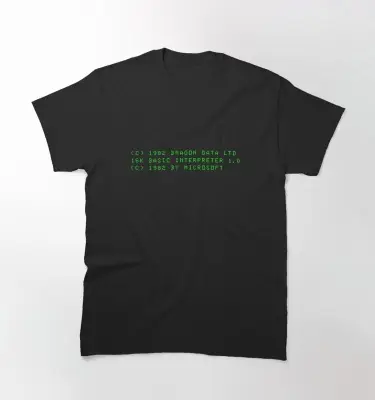
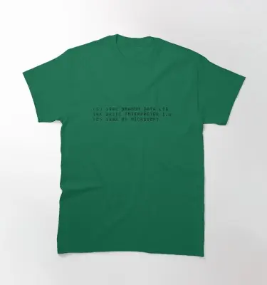
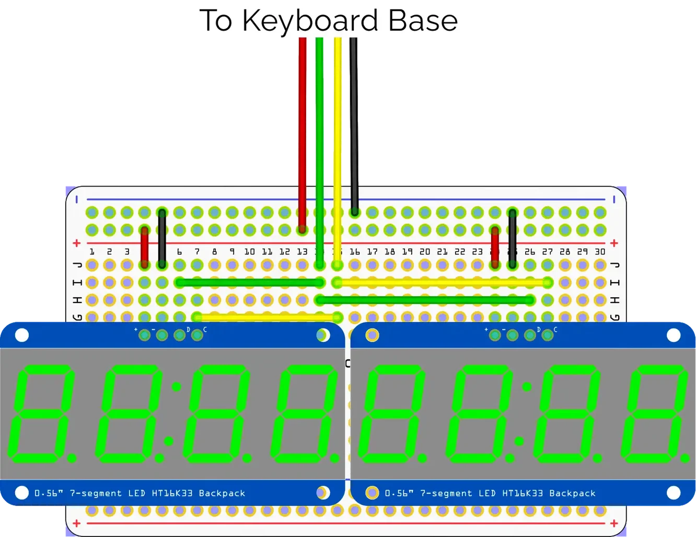
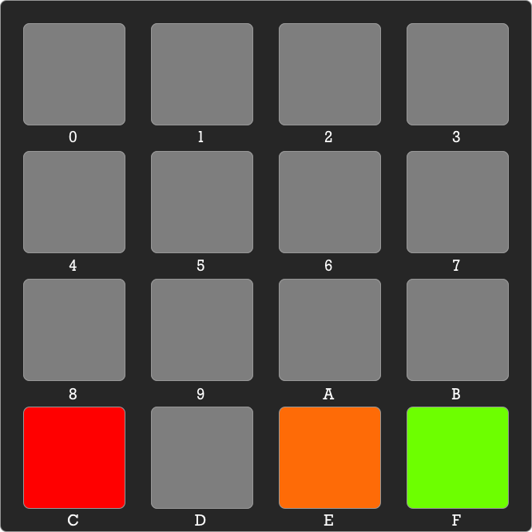

# e6809 0.0.2

An emulation of the Motorola 6809e 8-bit microprocessor designed to run on the RP2040 microcontroller board, such as the Raspberry Pi Pico.

It is intended for standalone usage — though not as a drop in replacement for an original 6808e — and within a microprocessor kit design called the Monitor Board.

There are two versions:

1. Raspberry Pi Pico - [branch `main`](https://github.com/smittytone/e6809/tree/main)
1. Mac — [branch `mac`](https://github.com/smittytone/e6809/tree/mac)

Current development activity is centred on the `main` branch. The `pico` branch will soon be removed. The `mac` branch is out of data and will be removed.

**This is a work in progress which I tackle occasionally. Expect errors, breakage and a slow response to bug reports!**

## 6809 Merch

[](https://www.redbubble.com/i/t-shirt/6809-microprocessor-by-squinter-mac/85380308.IJ6L0)

Show your support: [buy a 6089 T-shirt here](https://www.redbubble.com/i/t-shirt/6809-microprocessor-by-squinter-mac/85380308.IJ6L0)!

And for Dragon fans in particular:

[](https://www.redbubble.com/i/t-shirt/Dragon-Data-Logo-by-squinter-mac/83509782.IJ6L0) [](https://www.redbubble.com/i/t-shirt/Dragon-Data-Logo-Slim-by-squinter-mac/83509973.IJ6L0) [](https://www.redbubble.com/i/t-shirt/Dragon-Boot-Message-Reverse-Video-by-squinter-mac/46847689.IJ6L0) [](https://www.redbubble.com/i/t-shirt/Dragon-Boot-Message-by-squinter-mac/46847619.1482B)

## The CPU

The CPU is booted and run on power up. The code checks for the presence of the [Monitor Board](#the-monitor-board) and will switch to that if it is available. If not, it currently runs the CPU test suite, but this will change as I near ‘release’.

### Interrupts

The 6809e’s `NMI`, `IRQ` and `FIRQ` interrupts are broken out to the RP2040’s GPIO pins 22, 20 and 21, respectively. Other control pins, such as `HALT` and `RESET`, will be added. If the pin reads a HIGH signal, the interrupt is triggered.

## The Monitor Board

The Monitor Board is based on [Pimoroni’s RGB Keyboard Base](https://shop.pimoroni.com/products/pico-rgb-keypad-base) add-on for the Raspberry Pi Pico. It also uses a custom display board based on two HT16K33-driven four-digit, seven-segment LED displays.

For the display board mount the two [Adafruit 0.56in 4-digit 7-segment](https://www.adafruit.com/product/880) side by side on a breadboard. Make sure the two displays have different I&sup2;C addresses [as described here](https://learn.adafruit.com/adafruit-led-backpack/0-dot-56-seven-segment-backpack-assembly). Connect each of the two displays’ SDA, SCL, GND and 3V3 pins to four common connection points, and these four to the Keyboard Base’s 3V3, GND, GPIO 4 (SDA) and GPIO 5 (SCL) headers.

The board typically shows an 8-bit value (left four digits) and a 16-bit address (right four digits) both in hexadecimal.



The Monitor code is menu driven. It provides code entry, program execution and memory inspection functions.

### Main Menu


* `0` — Step through memory, down.
* `3` — Step through memory, up.
* `B` — Load code via USB.
* `C` — Run code.
* `D` — Run code in single-step mode.
* `E` — Enter a byte at the current address.
* `F` — Enter the current address.

When you run code, whether without breaks or in single-step mode, the Program Counter is set to the current address. This can be set by entering it directly (hit the yellow key) or by stepping to the required address using the upper blue keys.

### Confirm Menu



* `C` — Exit to main menu.
* `E` — Accept the current byte and continue in data-entry mode.
* `E` — Flip between address/value and register views.
* `F` — Accept the current byte or address and return to previous menu.

The orange button (shown above) is only illuminated when you have entered a byte value. Tap it to store the byte and continue in byte-entry mode, or hit green to store the byte and return to the main menu. Hitting red ignores the entered byte value.

The magenta button (not shown above; also key `E`) is only illuminated when you have paused running code. Tap it to change the display mode (see next section).

### Single-step Menu


* `0` — Step through memory, down.
* `3` — Step through memory, up.
* `D` — Reset display to current address.
* `E` — MOve between address/value and register views.
* `F` — Process instruction at current address.

Using the memory step keys can take you away from the address referenced by the 6809e’s Program Counter register. Hit the orange button to align the display with the PC.

Pressing the magenta button cycles the display through the following outputs:

* Current address (PC register) and that memory location’s contents.
* The Condition Code register bits (E, F, H, I, N, Z, V and C) as a binary value.
* The A, B and Direct Page registers in that order.
* The X and Y registers.
* The S and U registers.

### The Run Menu

When you are running code without automatically pausing between instructions, the keypad will glow white. Tap any key to halt the code. The keys will cease to glow and the [Confirm Menu](#confirm-menu) will be shown. If the keys cease to glow without a key press, then the code has returned.

### Loading Code

Use the `loader.py` utility in `/scripts` to send binary program data in the form of `.rom` files to the monitor. To upload a file:

1. Press `B` (magenta) at the main menu to prepare the board for loading.
2. On your computer, run `python loader.py -s <start_address> -d <device_name> <rom_file>`.

`-s` specifies the 16-bit address at which the program will be stored. `-d` specifies the monitor board’s device file under macOS or Linux. For example:

```shell
python loader.py -s 0x8000 -d /dev/cu.usbmodem1414301 d32.rom
```

The Pico LED will flash five times to signal a load error, if one occurred. There is a 30s timeout after which the loading will stop and the main menu will be accessible again.

You can use [Spasm](https://github.com/smittytone/Spasm) to generate assembled `.rom` files:

```shell
spasm.py -o test.rom test.asm
```

## RP2040 Pinout (Provisional!)

```
NMI•    0   - -------- -  VBUS
IRQ•    1   - |      | -  VSYS
        G   - |      | -  G
FIRQ•   2   - |      | -  3V3EN
RESET•  3   - |  R   | -  3V3   3V3*
SDA*    4   - |  P   | -  
SCL*    5   - |  2   | -  28
        G   - |  0   | -  G
PA0†    6   - |  4   | -  27
PA1†    7   - |  0   | -  26
PA2†    8   - |      | -  RUN
PA3†    9   - |      | -  22
        G   - |      | -  G
PA4†    10  - |      | -  21
PA5†    11  - |      | -  20
PA6†    12  - |      | -  19    TX*
PA7†    13  - |      | -  18    SCK*
        G   - |      | -  G
CA1†    14  - |      | -  17    CS*
CA2†    15  - -------- -  16
```

&#42; Keypad Monitor board<br />
• 6809E<br />
† MC6821 PIA

**SUBJECT TO CHANGE**

## To Do

In no particular order...

* Add Motorola PIA chip support.
* Add 6809e start-up sequence when Monitor Board not present.
* Clock-precise (1MHz) processing.
* Support alternative memory maps, not just a flat 64KB space.
* Support 64KB memory pages.
* Add downloading of RAM contents via USB.

## Copyright

Emulation software copyright &copy; 2025 Tony Smith (@smittytone)

6809e ISA copyright &copy; 1977 Motorola &mdash; and, by sequential ownership, NXP Semiconductor.
