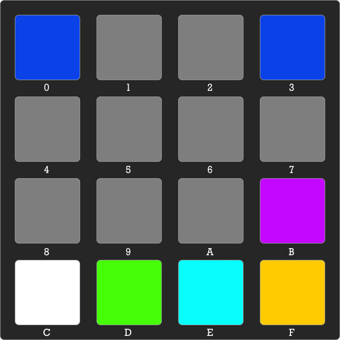
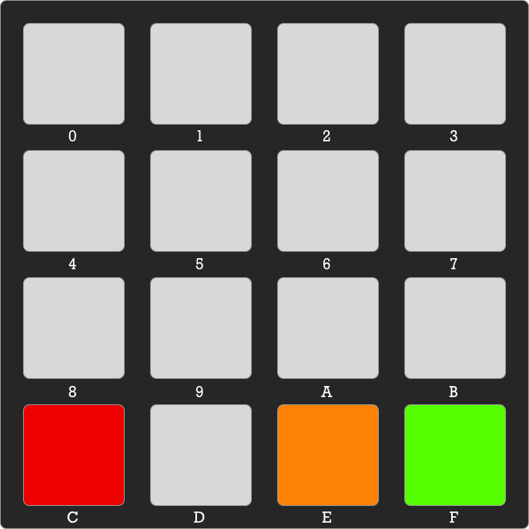
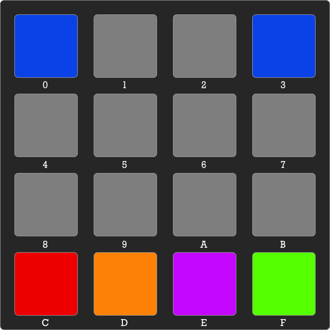

# e6809 #

An emulation of the Motorola 6809e 8-bit microprocessor designed to run on the a RP2040 microcontroller board, such as the Raspberry Pi Pico.

It is intended for standalone usage — though not as a drop in replacement for an original 6808e — and within a microprocessor kit design called the Monitor Board.

This is a work in progress, and not yet released to the public.

## The Monitor Board

The Monitor Board is based on [Pimoroni’s RGB Keyboard Base](https://shop.pimoroni.com/products/pico-rgb-keypad-base) add-on for the Raspberry Pi Pico. It also uses a custom display board based on two HT16K33-driven four-digit, seven-segment LED displays.

The Monitor code is menu driven. It provides code entry, program running and memory inspection.

### Main Menu

* `0` — Step through memory, down.
* `3` — Step through memory, up.
* `C` — Run code.
* `D` — Run code in single-step mode.
* `E` — Enter a byte at the current address.
* `F` — Enter the current address.

When you run code, whether without breaks or in single-step mode, the Program Counter is set to the current address. This can be set by entering it directly (hit the yellow key) or by stepping to the required address using the blue keys.

### Confirm Menu

* `C` — Exit to main menu.
* `E` — Accept the current byte and continue in data-entry mode.
* `F` — Accept the current byte or address and return to previous menu.

The orange button is only illuminated when you have entered a byte value. Tap it to go straight to byte-entry mode, or hit green to store the byte and return to the main menu.

### Single-step Menu

* `0` — Step through memory, down.
* `3` — Step through memory, up.
* `D` — Reset display to current address.
* `E` — Flip between address/value and Condition Code register views.
* `F` — Process instruction at current address.

Using the memory step keys can take you away from the address referenced by the 6809e’s Program Counter register. Hit the orange button to align the display with the PC.

Pressing the magenta button cycles the display through the following outputs:

* Current address (PC register) and that memory location’s contents.
* The Condition Code register bits as a binary value.
* The Direct Page register on the left; the A and B registers on the right.
* The X and Y registers.
* The S and U registers.

### The Run Menu

When you are running code without automatically pausing between instructions, the keypad will glow white. Tap any key to halt the code. The keys will cease to glow. If the keys cease to glow without a key press, then the code has returned. Tap any key to return to the main menu.

## Copyright

Emulation software copyright &copy; 2017-21 Tony Smith (@smittytone)

6809e ISA copyright &copy; 1977 Motorola &mdash; and, by sequential ownership, NXP Semiconductor.
